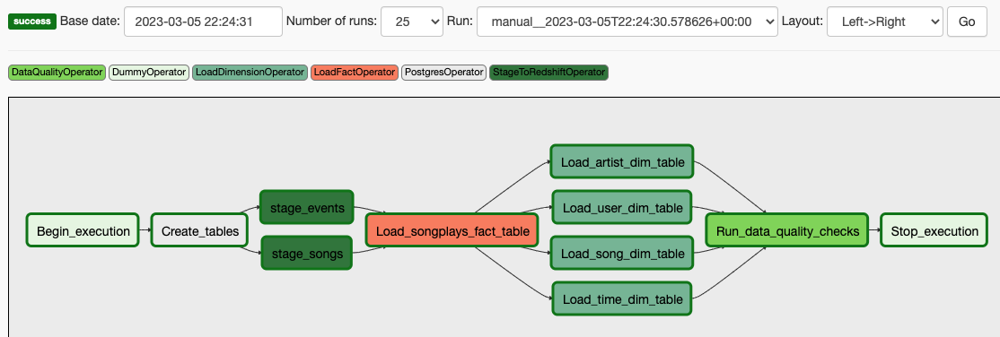

# Project: Data Pipelines

## Purpose

A music streaming company, Sparkify, has decided that it is time to introduce more automation and monitoring to their data warehouse ETL pipelines and come to the conclusion that the best tool to achieve this is Apache Airflow.

They have also noted that the data quality plays a big part when analyses are executed on top the data warehouse and want to run tests against their datasets after the ETL steps have been executed to catch any discrepancies in the datasets.

The source data resides in S3 and needs to be processed in Sparkify's data warehouse in Amazon Redshift. The source datasets consist of JSON logs that tell about user activity in the application and JSON metadata about the songs the users listen to.

## ELT Pipeline

### Pipeline

* Graph

* Structure

### /
* create_tables.sql - Contains the DDL for all tables used in this projecs
### dags
* udac_example_dag.py - The DAG configuration file to run in Airflow
#### plugins
* operators
  * stage_redshift.py - Operator to read files from S3 and load into Redshift staging tables
  * load_fact.py - Operator to load the fact table in Redshift
  * load_dimension.py - Operator to read from staging tables and load the dimension tables in Redshift
  * data_quality.py - Operator for data quality checking
* helpers
  * sql_queries - Redshift statements used in the DAG

